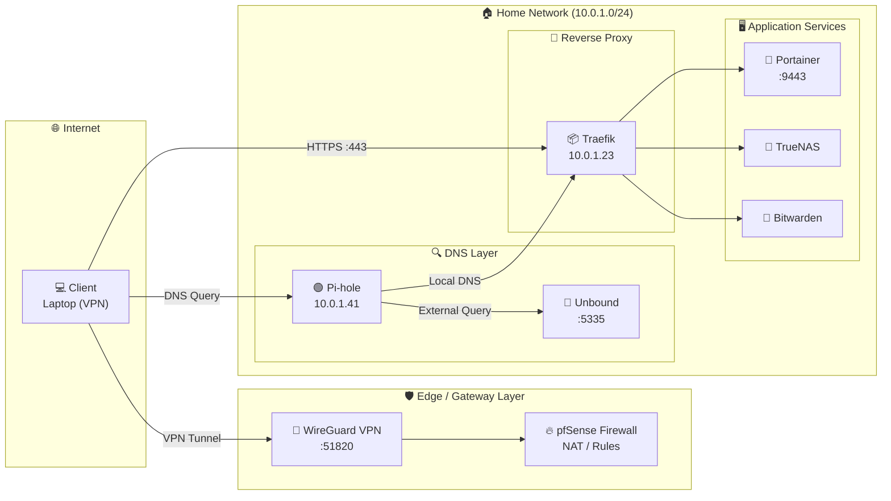

# 🔐 VPN & Private DNS — HomeLab Network Stack

Secure remote access and fully private DNS for a self-hosted HomeLab.
WireGuard tunnels external clients into the home network, Pi-hole handles ad-blocking and local DNS resolution, Unbound acts as a recursive resolver for complete DNS privacy, and Traefik reverse-proxies all internal services over HTTPS.

---

## 📐 Architecture Overview



---

## 🔄 Traffic Flow

```text
External Client
    │
    ├─── [1] WireGuard tunnel on :51820
    │         Encrypted VPN handshake → pfSense assigns internal IP
    │
    ├─── [2] DNS query → Pi-hole (10.0.1.41)
    │         ├── Local hostname (*.local) → resolves to Traefik (10.0.1.23)
    │         └── External domain → forwarded to Unbound (:5335)
    │                   └── Unbound queries authoritative DNS directly
    │                       (no third-party resolver — full DNS privacy)
    │
    └─── [3] HTTPS request → Traefik (10.0.1.23:443)
              ├── portainer.local  → Portainer :9443
              ├── truenas.local    → TrueNAS
              └── bitwarden.local  → Bitwarden
```

---

## 🧱 Stack

| Component | Role | Address |
|---|---|---|
| WireGuard | VPN tunnel — encrypted entry point | `:51820` |
| pfSense | Firewall, NAT, access control rules | Gateway |
| Pi-hole | Ad-blocking + local DNS resolver | `10.0.1.41` |
| Unbound | Recursive DNS resolver (no upstream leak) | `:5335` |
| Traefik | HTTPS reverse proxy + TLS termination | `10.0.1.23` |
| Portainer | Docker container manager | `:9443` |
| TrueNAS | NAS / file server | — |
| Bitwarden | Self-hosted password manager | — |

---

## ⚙️ Component Setup Guides

Detailed setup instructions for each component can be found in their respective folders:

- **[pfSense WireGuard Setup](./pfsense/wireguard-setup.md)**
- **[pfSense Firewall Rules](./pfsense/firewall-rules.md)**
- **[Unbound Resolver](./unbound/README.md)**
- **[Pi-hole Ad Blocking & DNS](./pihole/README.md)**
- **[Traefik Reverse Proxy](./traefik/README.md)**

### Prerequisites

- A server or VM running Linux (Ubuntu 22.04 recommended)
- Docker + Docker Compose installed
- pfSense or equivalent firewall as your network gateway
- A static LAN IP for the machine running Pi-hole and Traefik

---

## 🔒 Security Design Decisions

| Decision | Reason |
|---|---|
| WireGuard over OpenVPN | Smaller attack surface, faster handshake, modern cryptography (ChaCha20, Curve25519) |
| pfSense as gateway firewall | Stateful packet inspection, explicit allow-list rules — deny by default |
| Unbound instead of forwarding to 8.8.8.8 | DNS queries never leave your network — no data leakage to Google or Cloudflare |
| Pi-hole local DNS → Traefik | Services are never accessible by IP directly, only via authenticated reverse proxy |
| Split tunnel by default | Only HomeLab traffic routed through VPN — reduces latency for general browsing |
| HTTPS everywhere via Traefik | All internal traffic encrypted even inside the LAN |

---

## 🧪 Testing & Verification

#### Verify WireGuard tunnel is up

```bash
sudo wg show
# Should show: peer, endpoint, latest handshake, transfer stats
```

#### Verify DNS is routing through Pi-hole

```bash
# From a connected VPN client:
nslookup portainer.local
# Expected: returns 10.0.1.23 (Traefik IP)

nslookup google.com
# Expected: returns public IP — resolved via Unbound
```

#### Verify Unbound is resolving externally

```bash
dig google.com @10.0.1.41
# Check the "SERVER:" line — should show Pi-hole's IP
# Query time should be <100ms after first cached resolution
```

#### Verify no DNS leaks

Visit [dnsleaktest.com](https://dnsleaktest.com) while connected to VPN.
If using full tunnel (`AllowedIPs = 0.0.0.0/0`), results should show only your home IP — not your ISP's resolver.

#### Check Pi-hole is blocking ads

```bash
nslookup doubleclick.net 10.0.1.41
# Expected: returns 0.0.0.0 (blocked)
```

---

## 📁 Repository Structure

```text
vpn-dns-homelab/
├── wireguard/
│   ├── wg0.conf              # Server config (redact private keys before committing)
│   └── client-template.conf  # Client config template
├── unbound/
│   └── homelab.conf          # Unbound resolver config
│   └── README.md             # Unbound setup guide
├── traefik/
│   ├── docker-compose.yml
│   ├── traefik.yml
│   ├── certs/                # TLS certificates (gitignored)
│   └── README.md             # Traefik setup guide
├── pihole/
│   └── README.md             # Pi-hole setup guide
├── pfsense/
│   ├── firewall-rules.md     # NAT and LAN rules reference
│   └── wireguard-setup.md    # pfSense GUI WireGuard setup guide
└── README.md                 # Main overview and architecture
```

> ⚠️ **Never commit private keys or certificates to Git.**
> Add `wireguard/*_private.key` and `traefik/certs/` to `.gitignore`.

---

## 🛠️ Troubleshooting

**VPN connects but can't reach LAN services**
- Check pfSense LAN rules allow `10.8.0.0/24` → `10.0.1.0/24`
- Verify IP forwarding is enabled: `cat /proc/sys/net/ipv4/ip_forward` (should return `1`)
- On pfSense: confirm the WIREGUARD interface is enabled under Interfaces → Assignments

**pfSense WireGuard tunnel shows no handshake**
- Check WAN firewall rule allows UDP 51820 from any source
- Confirm the client `Endpoint` IP matches your WAN IP (check at `System → Routing → Gateways`)
- Verify the client public key in pfSense peer matches exactly — no trailing spaces

**pfSense peer shows handshake but no traffic**
- Ensure WIREGUARD interface rules exist (not just WAN rules)
- Check `Firewall → Rules → WIREGUARD` has a Pass rule for `10.8.0.0/24 → 10.0.1.0/24`
- Try disabling the block peer-to-peer rule temporarily to isolate the issue

**DNS not resolving local hostnames**
- Confirm WireGuard client config has `DNS = 10.0.1.41`
- Check Pi-hole local DNS records are saved correctly
- Test directly: `nslookup portainer.local 10.0.1.41`

**Unbound not starting**
- Check for port conflicts: `ss -tulpn | grep 5335`
- Validate config: `unbound-checkconf /etc/unbound/unbound.conf`

**Traefik returning 404**
- Confirm the container label `traefik.enable=true` is set
- Check the `Host()` rule matches the Pi-hole local DNS record exactly
- View Traefik logs: `docker logs traefik`

---

## 📚 References

- [WireGuard Official Docs](https://www.wireguard.com/quickstart/)
- [Pi-hole Docs](https://docs.pi-hole.net/)
- [Unbound DNS Setup for Pi-hole](https://docs.pi-hole.net/guides/dns/unbound/)
- [Traefik v3 Docs](https://doc.traefik.io/traefik/)
- [pfSense Docs](https://docs.netgate.com/pfsense/en/latest/)
- [pfSense WireGuard Package Docs](https://docs.netgate.com/pfsense/en/latest/vpn/wireguard/index.html)